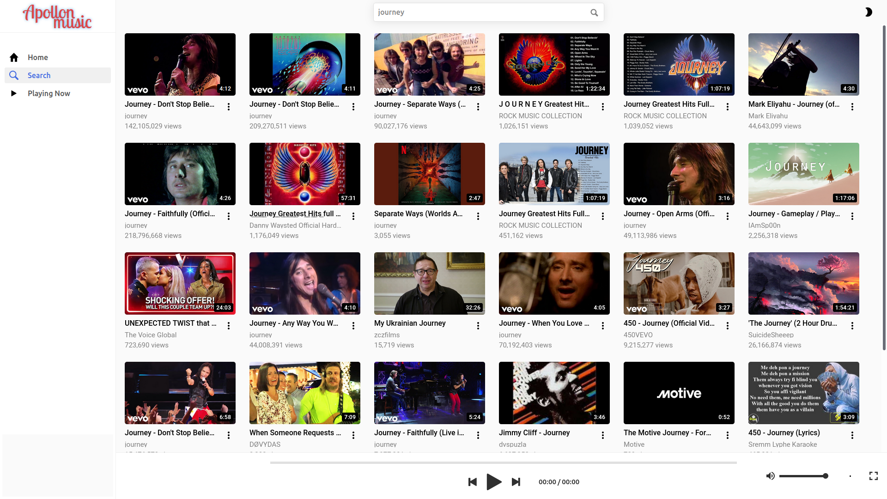
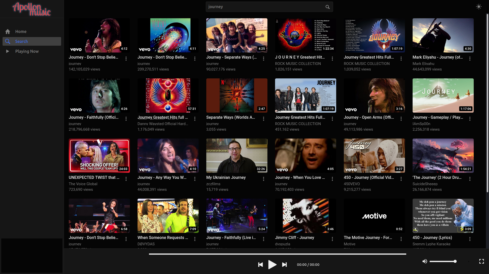
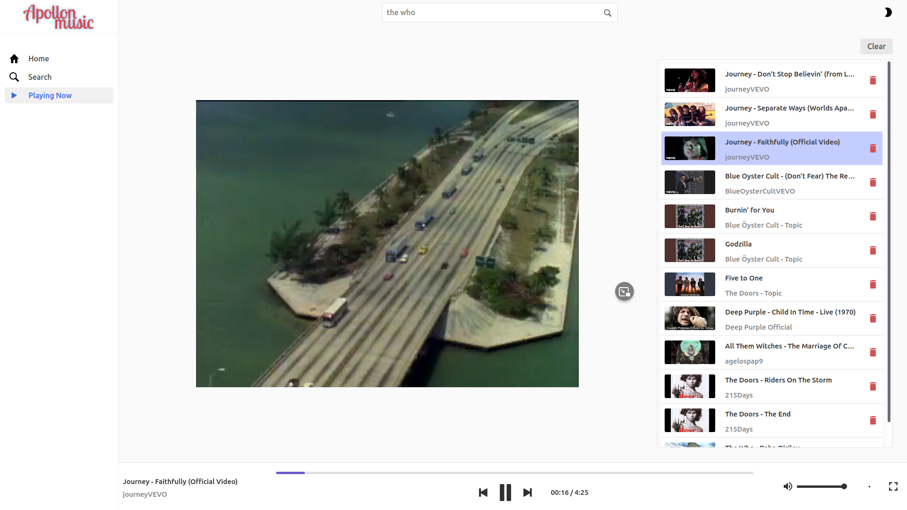
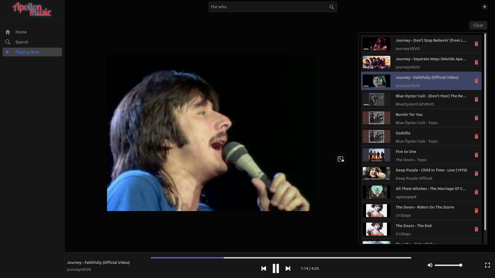

# Apollon Frontend

This project requires [Apollon back](https://github.com/pantz-marios/apollon-back) to run correctly.

&nbsp;

Search and play Youtube videos. 

&nbsp;



<!--  -->


&nbsp;

### Install Node.js and npm
In order to build and run, the following programs are required:
 * [Node.js](https://nodejs.org/en/), tested with version <b>v14.8.0</b>
 * [npm](https://docs.npmjs.com/cli/v7/configuring-npm/install)
 * [Angular](https://angular.io/), tested with version <b>10.0.14</b>

&nbsp;

### Build and run
To build and run, run the following commands:

 ```shell
  npm install         # install dependencies
  ng serve --open     # run in development mode
```